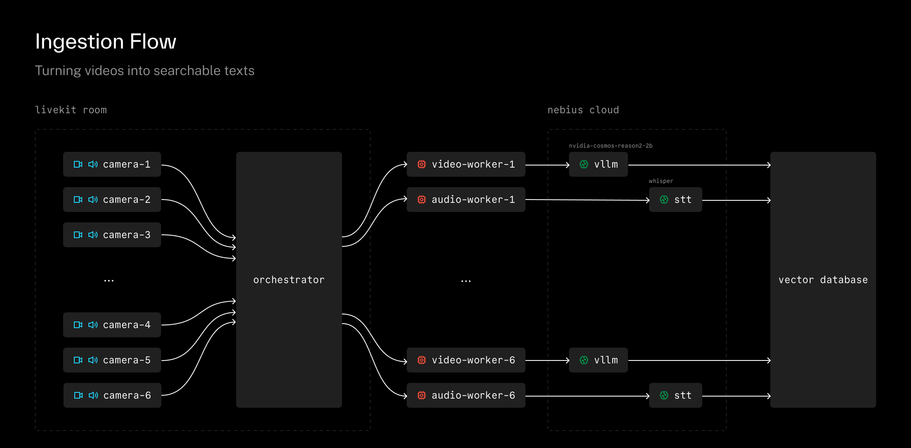
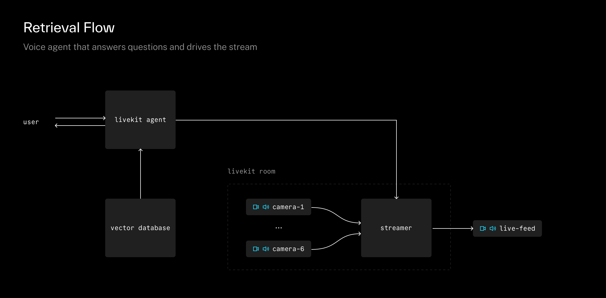

# cosmos-live

An intelligent video feed management system that orchestrates multiple live camera streams through a multiplexed architecture, enabling both manual voice control and AI-driven automated feed selection.

## Table of Contents

- [Features](#features)
- [Architecture](#architecture)
- [How It Works](#how-it-works)
- [Getting Started](#getting-started)
- [Configuration](#configuration)
- [Project Structure](#project-structure)
- [Dependencies](#dependencies)
- [Development](#development)

## Features

### Manual Feed Control

Direct voice commands for explicit feed selection.

> **User:** "put feed 1 up"
>
> **System:** The agent calls `switch_feed` to cut the live output to the requested camera.

### Autonomous Content Selection

AI agent analyzes available feeds in real-time and selects the most engaging content.

> **User:** "auto-direct this stream, pick the most interesting camera"
>
> **System:** The agent semantic-searches the latest vision analyses across all feeds, compares activity levels, and switches to the most active camera.

### Subject Tracking

Multi-camera person tracking that automatically switches feeds to maintain continuous coverage.

> **User:** "follow binh through cameras"
>
> **System:** The agent searches for recent vision chunks mentioning binh across all cameras. When binh leaves one camera and appears in another, the agent switches feeds to follow.

### Narrative Mode

Intelligent feed sequencing that creates cohesive storylines from multiple cameras.

> **User:** "create a narrative of the office tour"
>
> **System:** The agent retrieves vision chunks chronologically, identifies a sequence of related events across cameras, and sequences feed switches to assemble a coherent storyline.

### Security Monitoring

Real-time surveillance analysis powered by semantic search over continuous video feeds.

> **User:** "is there any suspicious activity in the last 10 minutes?"
>
> **System:** The agent searches for relevant vision analysis chunks and reports back with camera ID, time, and description of each flagged event.

## Architecture

The system runs two separate processes that share a Qdrant vector store:

- **Ingestion** (`ingestion_app.py`) — subscribes to camera feeds, runs vision analysis, writes text chunks to the store.
- **Retrieval** (`retrieval_app.py`) — LiveKit voice agent that reads from the store, answers questions, and controls the live stream output.

```
          INGESTION                               RETRIEVAL

Cameras ──► LiveKit ──► Orchestrator         User (voice)
                             │                     │
                ┌────────────┼────────────┐        │
                │            │            │        ▼
                ▼            ▼            ▼   LiveKit Agent
          VideoWorker  VideoWorker  AudioWorker  │        │
                │            │            │      │        │
           FrameBuffer  FrameBuffer     STT  queries  commands
                │            │            │      │        │
           VisionModel  VisionModel      │      │        ▼
                │            │            │      │   StreamOperator
                └────────────┴────────────┘      │        │
                             │                   │        ▼
                          writes                 │   MJPEG Stream
                             │                   │  (HTTP :9090)
                             ▼                   │
                        ┌─────────┐              │
                        │ Vector  │ ◄────────────┘
                        │ Store   │
                        └─────────┘
```

## How It Works

### Ingestion: turning video into searchable text



1. **Camera clients** publish live video and audio to a [LiveKit](https://livekit.io/) room.
2. The **Orchestrator** joins the room and subscribes to every track. For each video track it spawns a **VideoWorker**; for each audio track an **AudioWorker**.
3. Each VideoWorker has a **FrameBuffer** (a fixed-capacity ring buffer). Incoming frames are pushed into the buffer at the configured `target_fps`.
4. When the buffer is full, the worker **samples** N evenly-spaced frames, JPEG-encodes them as base64, and sends them to a **VisionModel** (vLLM running `nvidia/Cosmos-Reason2-2B`).
5. The vision model returns a natural-language description of what it sees.
6. That description is wrapped in a **Document** and inserted into the vector store. The store embeds the text using `all-MiniLM-L6-v2` (384-dim vectors) and indexes it for semantic search.

AudioWorkers do the same for speech: transcribe audio segments and store the transcript as a Document.

The result is a continuously growing collection of timestamped, camera-tagged text chunks that describe everything happening across all feeds.

### Retrieval: voice agent that answers questions and drives the stream



The retrieval side is a [LiveKit Agents](https://docs.livekit.io/agents/) voice pipeline. A user talks to the agent, and the agent talks back.

The **CosmosAgent** has access to these tools:

| Tool                                   | What it does                                                           |
| -------------------------------------- | ---------------------------------------------------------------------- |
| `query(text, top_k)`                   | Semantic search — finds documents by meaning (e.g., "someone cooking") |
| `search(kind, track_id, since, top_k)` | Metadata filter — search by track, kind, or time range                 |
| `switch_feed(feed_id)`                 | Switch the active stream to a different camera                         |
| `list_feeds()`                         | List all available camera participant identities                       |
| `set_overlay(slot, text)`              | Place a text overlay on the stream (`lower_third`, `title`, `banner`)  |
| `clear_overlay(slot)`                  | Remove an overlay                                                      |
| `start_stream()` / `stop_stream()`     | Start or stop the stream operator                                      |

When the agent calls `switch_feed` or `set_overlay`, the **StreamOperator** composites the selected video feed with overlays and serves it as an MJPEG stream over HTTP.

### Document schema

Every chunk stored in Qdrant follows the `Document` schema:

```python
@dataclass
class Document:
    content: str                          # text payload (vision description or transcript)
    track_id: str = ""                    # source camera (e.g. "cam-1")
    kind: str = ""                        # "video" or "audio"
    timestamp: float = 0.0                # capture time (epoch seconds)
    embedding: list[float] | None = None  # 384-dim vector, populated at insert time
```

Vectors are 384-dim normalized embeddings (`all-MiniLM-L6-v2`) with `COSINE` distance. A payload index on `timestamp` enables efficient time-ordered queries.

## Getting Started

### Prerequisites

- [uv](https://docs.astral.sh/uv/) — Python package manager
- [Docker](https://www.docker.com/) — for running Qdrant

### Setup

1. **Install uv** (if not already installed):

   ```bash
   curl -LsSf https://astral.sh/uv/install.sh | sh
   ```

2. **Install dependencies:**

   ```bash
   uv sync
   ```

3. **Copy and edit the config:**

   ```bash
   cp config.example.yaml config.yaml
   ```

   Fill in your LiveKit credentials, vLLM endpoint, and API keys.

4. **Start Qdrant:**

   ```bash
   docker run -d --name qdrant -p 6333:6333 -p 6334:6334 \
     -v qdrant_data:/qdrant/storage qdrant/qdrant
   ```

### Running

Run the two processes in separate terminals:

```bash
# Terminal 1: Ingestion pipeline
uv run python -m cosmos_live.ingestion_app

# Terminal 2: Voice agent + stream operator
uv run python -m cosmos_live.retrieval_app console
```

The MJPEG stream is available at `http://localhost:9090/stream` when the operator is configured.

## Configuration

See [`config.example.yaml`](config.example.yaml) for all available options.

| Section        | Description                                                               |
| -------------- | ------------------------------------------------------------------------- |
| `livekit`      | LiveKit server URL, API key, API secret, and room name                    |
| `vllm`         | vLLM server base URL, model name, and optional API key                    |
| `qdrant`       | Qdrant server URL, collection name, and embedding model                   |
| `video_worker` | Frame buffer size, sample count, target FPS, and the vision prompt        |
| `agent`        | Voice agent STT, LLM, and TTS model identifiers, plus system instructions |
| `operator`     | Stream operator resolution, FPS, and HTTP display port                    |

## Project Structure

```
cosmos_live/
├── ingestion_app.py        ← entry point: ingestion pipeline
├── retrieval_app.py        ← entry point: voice agent + stream operator
└── config.py               ← pydantic config models, loads config.yaml

packages/
├── core/                   ABCs and types
│   └── cosmos_core/
│       ├── types.py            Frame, AudioSegment, Document, Overlay
│       ├── buffer.py           FrameBuffer ABC
│       ├── ring_buffer.py      RingFrameBuffer implementation
│       ├── vision.py           VisionModel ABC
│       ├── storage.py          VectorStore ABC
│       ├── transcription.py    Transcriber ABC
│       └── streaming.py        StreamOperator ABC
│
├── storage/                Store implementations
│   └── cosmos_storage/
│       ├── memory.py           In-memory store (dev)
│       ├── milvus.py           Milvus vector store
│       └── qdrant.py           Qdrant vector store
│
├── ingestion/              Ingestion pipeline
│   └── cosmos_ingestion/
│       ├── orchestrator.py     Connects to LiveKit, spawns workers
│       ├── publisher.py        Captures and publishes to LiveKit
│       ├── video_worker.py     push_frame → buffer → sample → vision → store
│       ├── audio_worker.py     push_audio → transcribe → store
│       └── vllm.py             vLLM vision implementation
│
├── control/                Voice agent + stream operator
│   └── cosmos_control/
│       ├── agent.py            CosmosAgent — LiveKit voice agent with tools
│       └── operator.py         StreamOperator — composites feed + overlays, serves MJPEG
│
└── utils/                  Shared utilities
    └── cosmos_utils/
        └── token.py            LiveKit JWT token generation
```

## Dependencies

### Python (>= 3.12)

This project uses [uv](https://docs.astral.sh/uv/) for dependency management. All dependencies are installed via `uv sync`.

| Package                          | Used By            | Purpose                                                                     |
| -------------------------------- | ------------------ | --------------------------------------------------------------------------- |
| `livekit` >= 1.0                 | ingestion, control | WebRTC SDK for real-time video/audio transport                              |
| `livekit-api` >= 1.0             | ingestion, utils   | LiveKit server API and JWT token generation                                 |
| `livekit-agents` >= 1.0          | root, control      | LiveKit Agents framework (voice pipeline, `AgentSession`, `@function_tool`) |
| `livekit-plugins-silero` >= 1.0  | root               | Voice Activity Detection (VAD)                                              |
| `openai` >= 1.0                  | ingestion          | AsyncOpenAI client for vLLM (OpenAI-compatible API)                         |
| `opencv-python-headless` >= 4.10 | ingestion          | Video frame encoding (JPEG for base64 payloads)                             |
| `opencv-python` >= 4.10          | control            | Frame compositing and overlay rendering                                     |
| `Pillow` >= 10.0                 | control            | Text overlay rendering                                                      |
| `qdrant-client` >= 1.12          | storage            | Qdrant vector database client                                               |
| `pymilvus` >= 2.4                | storage            | Milvus vector database client                                               |
| `milvus-lite` >= 2.4             | storage            | Embedded Milvus (local, no server)                                          |
| `sentence-transformers` >= 3.0   | storage            | Text embedding model (`all-MiniLM-L6-v2`)                                   |
| `numpy` >= 2.0                   | core, control      | Frame data representation                                                   |
| `pydantic` >= 2.12.5             | root, utils        | Config validation and type-safe YAML parsing                                |
| `pyyaml` >= 6.0.3                | root               | YAML config file loading                                                    |

Dev dependencies: `pytest` >= 8, `pytest-asyncio` >= 1.

### External Services

| Service                        | Purpose                                             | Config      |
| ------------------------------ | --------------------------------------------------- | ----------- |
| [LiveKit](https://livekit.io/) | WebRTC server for video/audio transport             | `livekit.*` |
| [vLLM](https://docs.vllm.ai/)  | Vision model inference (`nvidia/Cosmos-Reason2-2B`) | `vllm.*`    |
| [Qdrant](https://qdrant.tech/) | Vector database for document embeddings             | `qdrant.*`  |

The voice agent's STT, LLM, and TTS providers are configured through the LiveKit Agents plugin system in the `agent` section of `config.yaml`.

## Development

```bash
# Add a dependency to a specific package
uv add --package cosmos-ingestion <dep>

# Run tests
uv run pytest

# Run tests excluding integration tests (which require a running vLLM server)
uv run pytest -m "not integration"
```
